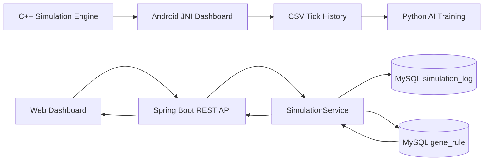

# BIO-OS: Algorithmic Bio-System Simulator

> **BIO-OS**는 식물의 생체 상태를 알고리즘으로 시뮬레이션하고,  
> C++ Engine, Android JNI Dashboard, Web Dashboard, Spring Boot REST API, MySQL, Python AI Pipeline으로 확장한 풀스택 시뮬레이션 프로젝트입니다.

---

## 1. Project Overview

BIO-OS는 Water, Light, Temperature 같은 환경 입력값을 기반으로 식물의 상태를 계산하는 생체 시스템 시뮬레이터입니다.

단순한 조건문 기반 시뮬레이션이 아니라,  
BFS, DFS, PriorityQueue 같은 자료구조와 알고리즘을 식물 생체 흐름에 적용하고,  
그 결과를 Android와 Web Dashboard에서 시각적으로 확인할 수 있도록 설계했습니다.

현재 BIO-OS는 다음 흐름으로 확장되었습니다.

```text
C++ Simulation Engine
→ Android JNI Dashboard
→ CSV Log
→ Python AI Training Pipeline
→ Web Dashboard
→ Spring Boot REST API
→ MySQL Database
```

---

## 2. Key Features

### C++ Simulation Engine

- BFS 기반 WaterDistributor
- DFS 기반 EnergyEvaluator
- PriorityQueue 기반 PruningStrategy
- RuleParser
- StateTransitionEngine
- TickSystem
- SimulationLogger
- EngineFacade

### Android Dashboard

- JNI를 통한 C++ Engine 호출
- Tick 기반 시뮬레이션 실행
- Plant Structure View
- Plant Pixel View
- Pixel / Structure View Mode 전환
- CSV Tick History 저장

### Python AI Pipeline

- Android에서 저장한 CSV 로그 기반 학습
- `waterInput`, `light`, `temperature` 기반 `lastAction` 예측
- DecisionTreeClassifier 기반 초기 모델 구현
- 모델 및 LabelEncoder 저장

### Web Dashboard

- Water / Light / Temperature 입력
- Run Simulation
- Random Sample
- Load DB Logs
- Clear Logs
- Plant Pixel View
- Simulation Result Card
- Active States
- Matched Rules
- Risk Level
- Energy Delta
- Recommendation
- Tick History Table
- Gene Rule Registry

### Spring Boot Backend

- MVC 계층 구조 적용
- Request / Response DTO 분리
- REST API 구현
- MySQL 연동
- JPA Repository 사용
- Simulation Log 저장 / 조회 / 삭제
- GeneRule 저장 / 조회 / 활성화 토글 / 삭제
- 기본 GeneRule Seeder 자동 등록
- DB 기반 GeneRule을 실제 시뮬레이션 계산에 반영

---

## 3. Architecture



---

## 4. Tech Stack

### Core Engine

- C++
- STL
- BFS
- DFS
- PriorityQueue

### Android

- Java
- Android Studio
- JNI
- Custom View
- Canvas
- Pixel Art Assets

### AI

- Python
- pandas
- scikit-learn
- joblib
- DecisionTreeClassifier

### Web

- HTML
- CSS
- JavaScript
- Fetch API

### Backend

- Java
- Spring Boot
- Spring Web
- Spring Data JPA
- MySQL
- Maven
- DTO
- MVC Architecture

---

## 5. Project Structure

```text
Bio_OS/
├─ app/
│  └─ Android Dashboard
│
├─ ai/
│  ├─ bio_os_tick_history.csv
│  ├─ train_action_model.py
│  ├─ predict_action.py
│  ├─ bio_os_action_model.pkl
│  └─ bio_os_label_encoder.pkl
│
├─ web/
│  ├─ index.html
│  ├─ style.css
│  ├─ app.js
│  └─ assets/
│
└─ backend/
   └─ bio-os/
      └─ src/main/java/com/yusolbin/bio_os/
         ├─ controller/
         │  ├─ HomeController.java
         │  ├─ SimulationController.java
         │  └─ GeneRuleController.java
         │
         ├─ service/
         │  ├─ SimulationService.java
         │  └─ GeneRuleService.java
         │
         ├─ dto/
         │  ├─ SimulationRequest.java
         │  ├─ SimulationResponse.java
         │  ├─ SimulationLogResponse.java
         │  ├─ GeneRuleRequest.java
         │  └─ GeneRuleResponse.java
         │
         ├─ model/
         │  ├─ SimulationLog.java
         │  └─ GeneRule.java
         │
         ├─ repository/
         │  ├─ SimulationLogRepository.java
         │  └─ GeneRuleRepository.java
         │
         ├─ config/
         │  └─ DefaultGeneRuleSeeder.java
         │
         └─ BioOsApplication.java
```

---

## 6. GeneRule System

BIO-OS는 시뮬레이션 규칙을 코드에 고정하지 않고,  
MySQL에 저장된 GeneRule 데이터를 기반으로 상태를 계산합니다.

예시 GeneRule:

```text
IF Water < 30 THEN DroughtMode = ON / Effect -30
IF Light > 70 THEN PhotosynthesisBoost = ON / Effect +20
IF Temperature > 35 THEN HeatStress = ON / Effect -20
IF Water < 10 THEN PruningMode = ON / Effect -35
IF Water > 100 THEN RecoveryMode = ON / Effect +25
IF Water < 20 THEN ExtremeDroughtMode = ON / Effect -40
```

각 GeneRule은 다음 정보를 가집니다.

```text
fieldName
operator
threshold
targetState
energyEffect
active
createdAt
```

SimulationService는 `active=true`인 GeneRule만 조회하고,  
조건을 만족한 룰의 `targetState`를 activeStates에 추가하며,  
`energyEffect`를 totalEnergy 계산에 반영합니다.

---

## 7. Simulation Analysis

BIO-OS는 단순히 결과값만 반환하지 않고,  
결과가 발생한 원인까지 함께 반환합니다.

Simulation Response 예시:

```json
{
  "logId": 66,
  "tick": 1,
  "water": 5.0,
  "light": 80.0,
  "temperature": 32.0,
  "totalEnergy": 0.0,
  "lastAction": "Pruning",
  "visualState": "dead_critical",
  "activeStates": [
    "ExtremeDroughtMode",
    "DroughtMode",
    "PhotosynthesisBoost",
    "PruningMode"
  ],
  "energyDelta": -85.0,
  "matchedRules": [
    "IF Water < 30.0 THEN DroughtMode = ON / Effect -30.0",
    "IF Light > 70.0 THEN PhotosynthesisBoost = ON / Effect 20.0",
    "IF Water < 10.0 THEN PruningMode = ON / Effect -35.0",
    "IF Water < 20.0 THEN ExtremeDroughtMode = ON / Effect -40.0"
  ],
  "riskLevel": "CRITICAL",
  "recommendation": "Energy level is critically low. Increase water input and reduce stress conditions immediately."
}
```

이를 통해 BIO-OS는 다음 정보를 추적할 수 있습니다.

```text
입력 환경값
→ 매칭된 GeneRule
→ 에너지 변화량
→ 활성화된 상태
→ 위험도
→ 추천 조치
→ 시각화 상태
```

---

## 8. REST API

### Simulation API

#### Run Simulation

```http
POST /api/simulations/run
```

Request:

```json
{
  "water": 5,
  "light": 80,
  "temperature": 32
}
```

Response:

```json
{
  "logId": 1,
  "tick": 1,
  "totalEnergy": 0.0,
  "lastAction": "Pruning",
  "visualState": "dead_critical",
  "riskLevel": "CRITICAL",
  "energyDelta": -85.0,
  "activeStates": [
    "DroughtMode",
    "PhotosynthesisBoost",
    "PruningMode",
    "ExtremeDroughtMode"
  ],
  "matchedRules": [
    "IF Water < 30.0 THEN DroughtMode = ON / Effect -30.0",
    "IF Light > 70.0 THEN PhotosynthesisBoost = ON / Effect 20.0",
    "IF Water < 10.0 THEN PruningMode = ON / Effect -35.0",
    "IF Water < 20.0 THEN ExtremeDroughtMode = ON / Effect -40.0"
  ],
  "recommendation": "Energy level is critically low. Increase water input and reduce stress conditions immediately."
}
```

#### Get Simulation Logs

```http
GET /api/simulations/logs
```

#### Clear Simulation Logs

```http
DELETE /api/simulations/logs
```

---

### GeneRule API

#### Create GeneRule

```http
POST /api/rules
```

Request:

```json
{
  "fieldName": "Water",
  "operator": "LT",
  "threshold": 20,
  "targetState": "ExtremeDroughtMode",
  "energyEffect": -40
}
```

#### Get GeneRules

```http
GET /api/rules
```

#### Toggle GeneRule Active State

```http
PATCH /api/rules/{id}/toggle
```

#### Delete GeneRule

```http
DELETE /api/rules/{id}
```

---

## 9. How to Run

### 1. Start MySQL

Create database:

```sql
CREATE DATABASE bio_os;
```

---

### 2. Configure Spring Boot

Edit:

```text
backend/bio-os/src/main/resources/application.properties
```

Example:

```properties
spring.application.name=BIO-OS

server.port=8080

spring.datasource.url=jdbc:mysql://localhost:3306/bio_os?serverTimezone=Asia/Seoul&characterEncoding=UTF-8
spring.datasource.username=root
spring.datasource.password=YOUR_PASSWORD

spring.jpa.hibernate.ddl-auto=update
spring.jpa.show-sql=true
spring.jpa.properties.hibernate.format_sql=true
```

---

### 3. Run Spring Boot Backend

```bat
cd /d D:\CoreSync\Bio_OS\backend\bio-os
mvnw.cmd spring-boot:run
```

Backend server:

```text
http://localhost:8080
```

---

### 4. Open Web Dashboard

Open:

```text
D:\CoreSync\Bio_OS\web\index.html
```

The Web Dashboard calls the Spring Boot API at:

```text
http://localhost:8080
```

---

### 5. Test API with curl

```bat
curl -X POST http://localhost:8080/api/simulations/run -H "Content-Type: application/json" -d "{\"water\":5,\"light\":80,\"temperature\":32}"
```

---

## 10. Screenshots

### Web Dashboard

> Add screenshot here.

```text
docs/screenshots/web-dashboard.png
```

### Gene Rule Registry

> Add screenshot here.

```text
docs/screenshots/gene-rule-registry.png
```

### Android Pixel View

> Add screenshot here.

```text
docs/screenshots/android-pixel-view.png
```

### Spring Boot API Response

> Add screenshot here.

```text
docs/screenshots/api-response.png
```

---

## 11. Current Progress

```text
✅ C++ Simulation Engine
✅ BFS / DFS / PriorityQueue algorithm modules
✅ Android JNI connection
✅ Android Dashboard
✅ Plant Structure View
✅ Plant Pixel View
✅ Pixel / Structure View Mode Toggle
✅ CSV Tick History
✅ Python AI Training Pipeline
✅ Web Dashboard Prototype
✅ Spring Boot REST API
✅ MySQL integration
✅ Simulation Log save / load / clear
✅ GeneRule save / load / toggle / delete
✅ Default GeneRule Seeder
✅ energyEffect-based simulation
✅ matchedRules tracking
✅ riskLevel and recommendation response
✅ Web Dashboard analysis display
```

---

## 12. Future Work

```text
⬜ Connect C++ Engine directly to Spring Boot Backend
⬜ Add AI prediction API
⬜ Improve GeneRule effect policy
⬜ Add Simulation Scenario Presets
⬜ Add authentication for dashboard management
⬜ Improve Web Dashboard responsive layout
⬜ Add chart visualization for totalEnergy trends
⬜ Deploy backend and dashboard
```

---

## 13. Development Logs

- Velog 01: C++ Engine, Android Dashboard, Web Prototype
- Velog 02: Web Dashboard, Spring Boot, MySQL 연결
- Velog 03: GeneRule energyEffect, matchedRules, riskLevel 분석 대시보드 예정

---

## 14. Author

**Yusolbin**

GitHub: https://github.com/yusolbin

