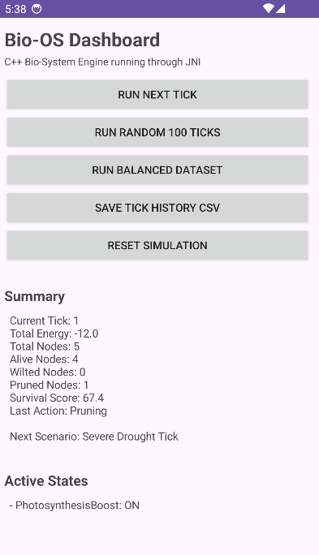
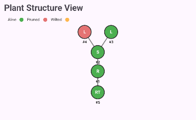
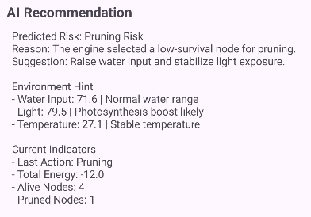
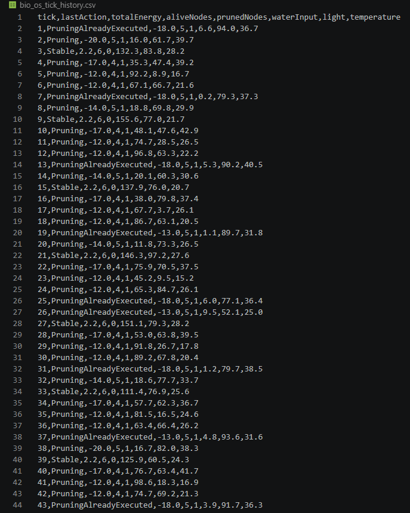
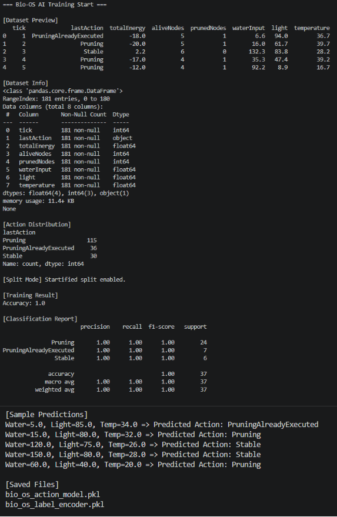

# Bio-OS: Algorithmic Bio-System Simulator

**Bio-OS**는 식물 생체 시스템을 알고리즘으로 시뮬레이션하는 프로젝트입니다.
C++ 기반 Native Simulation Engine을 만들고, Android 앱에서 JNI로 연결한 뒤, 시뮬레이션 결과를 CSV 데이터셋으로 저장하고 Python AI 모델로 학습하는 전체 파이프라인을 구현했습니다.

---

## Quick Summary

Bio-OS는 식물을 하나의 운영체제처럼 모델링합니다.

환경 입력값인 **Water, Light, Temperature**가 들어오면 C++ 엔진은 식물 트리 구조를 계산하고, Android 앱은 그 결과를 Dashboard와 Plant Structure View로 시각화합니다. 이후 앱에서 생성된 CSV 데이터를 Python으로 학습하여 환경 조건에 따른 식물 시스템의 행동을 예측합니다.

```text
Environment Input
→ C++ Bio-OS Engine
→ JNI Native Bridge
→ Android Dashboard
→ CSV Dataset Export
→ Python AI Training
→ AI Recommendation UI
```

---

## Highlights

* C++17 기반 Native Simulation Engine 구현
* Tree 구조 기반 식물 모델링
* BFS 기반 수분 분배 알고리즘
* DFS 기반 에너지 평가 알고리즘
* PriorityQueue 기반 가지치기 전략
* Rule-based Gene State Transition 구현
* Android JNI 연동
* Android Canvas 기반 Plant Structure View 구현
* Tick History 기록 및 CSV Export 기능 구현
* Python scikit-learn 기반 AI 학습 파이프라인 구축
* Android 앱 내 AI Recommendation UI 구현

---

## Tech Stack

| Area            | Tech                                 |
| --------------- | ------------------------------------ |
| Core Engine     | C++17, STL                           |
| Algorithms      | BFS, DFS, PriorityQueue, Tree        |
| Android         | Java, Android Studio, JNI, CMake     |
| Visualization   | Android Canvas Custom View           |
| Data            | CSV, JSON Snapshot                   |
| AI              | Python, pandas, scikit-learn, joblib |
| Version Control | Git, GitHub                          |

---


## Project Overview

Bio-OS는 식물 생체 시스템을 알고리즘 기반으로 분석하고 시뮬레이션하는 포트폴리오 프로젝트입니다.

식물은 Root, Stem, Leaf, RootTip 노드로 구성된 Tree 구조로 표현되며, 각 tick마다 환경 입력에 따라 수분, 에너지, 생존 점수, 가지치기 여부가 계산됩니다.

Android 앱에서는 C++ 엔진을 JNI로 호출하고, 결과를 Dashboard 형태로 시각화합니다. 또한 시뮬레이션 결과를 CSV로 저장하여 Python AI 모델 학습에 사용합니다.

---

## Core Features

### Native C++ Simulation Engine

* PlantTree 기반 식물 구조 관리
* Node별 Water, Energy, Survival Score 계산
* BFS 기반 Water Distribution
* DFS 기반 Energy Evaluation
* PriorityQueue 기반 Pruning Strategy
* Gene Rule 기반 State Transition
* JSON Snapshot 생성

### Android JNI Dashboard

* C++ 엔진을 Android Java 앱에서 호출
* Summary / Active States / Nodes / Logs 표시
* Plant Structure View 시각화
* Tick History 기록
* CSV 저장 기능
* AI Recommendation 표시

### AI Training Pipeline

* Android 앱에서 CSV Dataset 생성
* Python pandas로 데이터 로드
* scikit-learn DecisionTreeClassifier 학습
* joblib으로 모델 저장
* 환경 입력값 기반 lastAction 예측

---

## System Architecture

```text
[Water / Light / Temperature]
              |
              v
      [C++ Bio-OS Engine]
              |
              v
       [JNI Native Bridge]
              |
              v
      [Android Dashboard]
              |
              v
       [CSV Dataset Export]
              |
              v
       [Python AI Training]
              |
              v
      [AI Recommendation UI]
```

---

## Algorithms

### BFS Water Distribution

Root에서 시작하여 식물 트리의 각 노드로 수분을 분배합니다.

### DFS Energy Evaluation

Leaf의 광합성량과 각 노드의 유지 비용을 기반으로 전체 에너지 균형을 계산합니다.

### PriorityQueue Pruning

Leaf 노드의 생존 점수를 계산하고, 가장 생존 가치가 낮은 Leaf를 우선적으로 Pruning 처리합니다.

### Rule-based State Transition

환경 조건에 따라 DroughtMode, PhotosynthesisBoost, HeatStress, PruningMode, RecoveryMode 등의 상태를 활성화합니다.

예시:

```text
IF Water < 30 THEN DroughtMode = ON
IF Light > 70 THEN PhotosynthesisBoost = ON
IF Temperature > 35 THEN HeatStress = ON
IF Water < 10 THEN PruningMode = ON
IF Water > 100 THEN RecoveryMode = ON
```

---

## Android Dashboard

현재 Android 앱은 다음 기능을 제공합니다.

* Run Next Tick
* Run Random 100 Ticks
* Run Balanced Dataset
* Save Tick History CSV
* Reset Simulation
* Summary
* Active States
* AI Recommendation
* Plant Structure View
* Nodes
* Tick History
* Algorithm Logs
* Raw JSON Toggle

---

## AI Training Result Example

Balanced Dataset 학습 결과 예시:

```text
[Action Distribution]
Pruning                   115
PruningAlreadyExecuted     36
Stable                     30

[Training Result]
Accuracy: 1.0
```

Prediction 예시:

```text
Water=5.0, Light=85.0, Temp=34.0 => Predicted Action: PruningAlreadyExecuted
Water=15.0, Light=80.0, Temp=32.0 => Predicted Action: Pruning
Water=120.0, Light=75.0, Temp=26.0 => Predicted Action: Stable
Water=150.0, Light=80.0, Temp=28.0 => Predicted Action: Stable
Water=60.0, Light=40.0, Temp=20.0 => Predicted Action: Pruning
```

---

## Screenshots

> 아래 이미지는 추후 `docs/images/` 폴더에 추가 예정입니다.

### Android Dashboard



### Plant Structure View



### AI Recommendation



### CSV Dataset



### Python AI Training Result



---

## Project Structure

```text
Bio_OS/
├─ app/
│  └─ src/
│     └─ main/
│        ├─ java/com/cookandroid/bioosapp/
│        │  ├─ MainActivity.java
│        │  ├─ BioOSEngine.java
│        │  └─ PlantTreeView.java
│        └─ cpp/
│           ├─ CMakeLists.txt
│           ├─ native-lib.cpp
│           └─ bio_os_engine/
│              ├─ include/
│              └─ src/
│
├─ bio_os_engine/
│  ├─ include/
│  └─ src/
│
└─ ai/
   ├─ bio_os_tick_history.csv
   ├─ train_action_model.py
   ├─ predict_action.py
   ├─ bio_os_action_model.pkl
   └─ bio_os_label_encoder.pkl
```

---

## Current Status

```text
Bio-OS v0.1 Prototype Complete
```

Implemented:

* C++ Engine
* JNI Bridge
* Android Dashboard
* Plant Visualization
* CSV Export
* Python AI Training
* AI Prediction Test
* AI Recommendation UI

---

## Detailed Development Notes

## 1. 개발 배경

컴퓨터공학은 다른 분야와 결합될 때 더 강력해진다고 생각했습니다. Bio-OS는 이러한 관점에서 생명 시스템을 알고리즘과 소프트웨어 구조로 해석해보는 프로젝트입니다.

단순히 식물을 화면에 보여주는 앱이 아니라, 식물 내부에서 일어나는 자원 분배, 에너지 평가, 가지치기, 회복 조건을 자료구조와 알고리즘으로 설계하고, 그 결과를 모바일 환경에서 시각화하는 것을 목표로 했습니다.

---

## 2. 문제 정의

식물은 환경에 따라 계속 상태가 변합니다.

예를 들어:

* 물이 부족하면 DroughtMode가 활성화됩니다.
* 빛이 충분하면 PhotosynthesisBoost가 활성화됩니다.
* 온도가 높으면 HeatStress가 발생합니다.
* 특정 조건에서는 생존 점수가 낮은 Leaf가 가지치기됩니다.
* 물이 충분히 공급되면 회복 상태로 전환됩니다.

이러한 변화를 단순 if문 모음이 아니라, Tree 구조와 알고리즘 기반의 시뮬레이션 엔진으로 구현하는 것이 핵심 문제였습니다.

---

## 3. 시스템 설계

Bio-OS는 크게 네 개의 계층으로 구성됩니다.

```text
C++ Core Engine
Android JNI Layer
Android Dashboard UI
Python AI Pipeline
```

### C++ Core Engine

핵심 시뮬레이션 로직을 담당합니다.

* PlantNode
* PlantTree
* Environment
* TickSystem
* WaterDistributor
* EnergyEvaluator
* PruningStrategy
* RuleParser
* StateTransitionEngine
* SimulationLogger
* EngineFacade

### Android JNI Layer

C++ 엔진과 Android Java 앱을 연결합니다.

* Java에서 native method 선언
* C++에서 JNI 함수 구현
* CMake로 Native Library 빌드
* `System.loadLibrary("bio_os_native")`로 로드

### Android Dashboard UI

엔진 결과를 사용자가 이해할 수 있게 시각화합니다.

* Summary
* Active States
* AI Recommendation
* Plant Structure View
* Nodes
* Tick History
* Algorithm Logs

### Python AI Pipeline

Android 앱에서 생성한 CSV를 기반으로 AI 모델을 학습합니다.

* CSV 로드
* Feature / Label 분리
* Label Encoding
* DecisionTreeClassifier 학습
* 모델 저장
* 예측 테스트

---

## 4. 구현 과정

### Step 1. C++ Engine 구현

식물을 Tree 구조로 모델링했습니다.

각 노드는 다음 정보를 가집니다.

* id
* type
* parentId
* water
* maxWater
* energy
* maintenanceCost
* photosynthesisRate
* survivalScore
* status

### Step 2. 알고리즘 적용

BFS, DFS, PriorityQueue를 각각 다른 생체 시스템 로직에 연결했습니다.

| Algorithm     | Role                            |
| ------------- | ------------------------------- |
| BFS           | Root에서 각 노드로 Water 분배           |
| DFS           | Leaf 기반 Energy 계산               |
| PriorityQueue | Survival Score가 낮은 Leaf Pruning |
| Rule Parser   | 환경 조건 기반 상태 전이                  |

### Step 3. Android JNI 연결

C++ 엔진을 Android 앱에서 실행하기 위해 JNI Bridge를 구현했습니다.

구현 중 해결한 문제:

* CMake source file 누락
* `PruningStrategy.cpp` link error
* JNI 함수명 package mismatch 가능성 점검
* Java class duplicate error 해결
* AndroidManifest MainActivity ClassNotFound 해결

### Step 4. Android Dashboard 구현

초기에는 JSON을 그대로 TextView에 출력했습니다. 이후 Dashboard 형태로 개선했습니다.

개선 과정:

1. JSON Raw 출력
2. Summary 파싱
3. Active States 파싱
4. Nodes 파싱
5. Plant Structure View 추가
6. Tick History 추가
7. CSV 저장 기능 추가
8. AI Recommendation 추가

### Step 5. Plant Structure View 구현

Android Canvas Custom View를 사용해 식물 구조를 시각화했습니다.

* Root, Stem, Leaf, RootTip을 원으로 표시
* Parent-Child 관계를 선으로 연결
* Alive / Pruned / Wilted 상태를 색상으로 구분

### Step 6. CSV Dataset 생성

앱 내부 저장소에 CSV를 저장했습니다.

```text
/data/data/com.cookandroid.bioosapp/files/bio_os_tick_history.csv
```

이 파일을 Android Studio Device Explorer에서 추출하여 Python 학습에 사용했습니다.

### Step 7. Python AI 학습

처음에는 데이터가 Stable에 치우쳐 모델이 모든 입력을 Stable로 예측했습니다.

이를 해결하기 위해 Balanced Dataset 생성 기능을 추가했습니다.

기존 방식:

```text
하나의 엔진에서 100틱 연속 실행
→ 상태가 누적되어 특정 class로 쏠림
```

개선 방식:

```text
각 sample마다 엔진 초기화
→ 다양한 환경 조건을 독립적으로 테스트
→ Pruning / Stable 데이터 분포 개선
```

---

## 5. 주요 트러블슈팅

### 1. Java Duplicate Class Error

문제:

```text
Duplicate class found: BioOSEngine
```

원인:

`BioOSEngine.java`가 패키지 폴더 안과 java 루트에 중복 생성되어 있었습니다.

해결:

정상 위치만 남겼습니다.

```text
app/src/main/java/com/cookandroid/bioosapp/BioOSEngine.java
```

---

### 2. C++ Link Error

문제:

```text
undefined symbol: PruningStrategy::pruneLowestValueLeaf(PlantTree&)
```

원인:

`PruningStrategy.cpp`가 CMake 빌드 대상에 포함되지 않았습니다.

해결:

`src/algorithms/PruningStrategy.cpp` 위치를 수정하고 CMake source list에 포함되도록 설정했습니다.

---

### 3. MainActivity ClassNotFound

문제:

```text
ClassNotFoundException: com.cookandroid.bioosapp.MainActivity
```

원인:

`MainActivity.java`가 올바른 패키지 위치에 없었습니다.

해결:

아래 위치에 파일을 생성했습니다.

```text
app/src/main/java/com/cookandroid/bioosapp/MainActivity.java
```

---

### 4. JSON Node Parsing 문제

문제:

Nodes 섹션에 `No plant nodes` 또는 `Unknown`이 출력되었습니다.

원인:

JSON 구조에서 노드 배열 위치가 예상과 달랐습니다.

해결:

`nodes`, `plantNodes`, `plant.nodes`, `plant` 배열을 모두 탐색하도록 파서 로직을 개선했습니다.

---

### 5. AI Training Class Imbalance

문제:

처음 학습 데이터는 대부분 Stable이어서 모든 예측이 Stable로 나왔습니다.

해결:

Balanced Dataset 생성 버튼을 추가하고, 각 샘플마다 엔진을 초기화하여 독립 샘플을 생성했습니다.

---

### 6. train_test_split stratify Error

문제:

```text
The least populated class in y has only 1 member
```

원인:

특정 class가 1개뿐인데 stratify split을 사용했습니다.

해결:

class count가 2개 미만이면 stratify를 자동으로 비활성화하도록 수정했습니다.

---

## 6. 배운 점

이 프로젝트를 통해 다음을 학습했습니다.

* C++ 기반 시뮬레이션 엔진 설계
* 자료구조와 알고리즘을 실제 도메인 문제에 적용하는 방법
* BFS / DFS / PriorityQueue의 실전 활용
* Android JNI와 Native Library 연동
* CMake 기반 Android Native Build
* JSON Snapshot 설계와 파싱
* Android Canvas Custom View 구현
* 앱 내부 저장소 파일 저장
* CSV Dataset 생성
* Python AI 학습 파이프라인 구축
* 데이터 불균형 문제와 학습 결과 해석
* 포트폴리오 프로젝트를 단계적으로 확장하는 방법

---

## 7. 향후 개선 계획

* AI 모델을 Android 앱에 직접 탑재하거나 서버 API로 연결
* Spring Boot 서버를 통해 Python 모델 예측 API 제공
* MySQL에 시뮬레이션 로그 저장
* OpenGL 기반 식물 성장 애니메이션 구현
* 데이터셋 자동 생성 품질 개선
* AI Recommendation 고도화
* 더 다양한 생체 노드 타입 추가
* UI Bio Terminal Theme 적용
* 포트폴리오 데모 영상 제작

---

## Screenshots

아래 이미지는 Bio-OS Android 앱, CSV 데이터셋, Python AI 학습 결과를 보여줍니다.

---

### Android Dashboard

Bio-OS Android 앱의 메인 대시보드입니다.  
C++ Native Engine을 JNI로 연결하여 현재 tick, total energy, alive/pruned node 수, last action 등을 표시합니다.


---

### Plant Structure View

Android Canvas 기반으로 구현한 식물 구조 시각화 화면입니다.  
Root, Stem, Leaf, RootTip 노드를 표시하고, Alive / Pruned / Wilted 상태를 색상으로 구분합니다.


---

### AI Recommendation

엔진 결과와 환경 입력값을 기반으로 현재 위험도, 원인, 추천 행동을 표시하는 AI Recommendation 화면입니다.


---

### CSV Dataset

Android 앱에서 생성한 tick history CSV 데이터셋입니다.  
각 row는 하나의 simulation sample이며, AI 학습에 사용됩니다.

주요 컬럼:

- tick
- lastAction
- totalEnergy
- aliveNodes
- prunedNodes
- waterInput
- light
- temperature


---

### Python AI Training Result

Android 앱에서 생성한 CSV 데이터를 Python으로 학습한 결과입니다.  
pandas와 scikit-learn을 사용해 `waterInput`, `light`, `temperature`를 기반으로 `lastAction`을 예측합니다.


# Final Note

Bio-OS는 단순한 알고리즘 실습이 아니라, C++ 엔진, Android 앱, 데이터셋 생성, Python AI 학습까지 연결한 end-to-end 포트폴리오 프로젝트입니다.

```text
Algorithm → Simulation → Visualization → Dataset → AI → Recommendation
```

이 흐름을 하나의 프로젝트 안에서 구현했다는 점이 핵심입니다.
