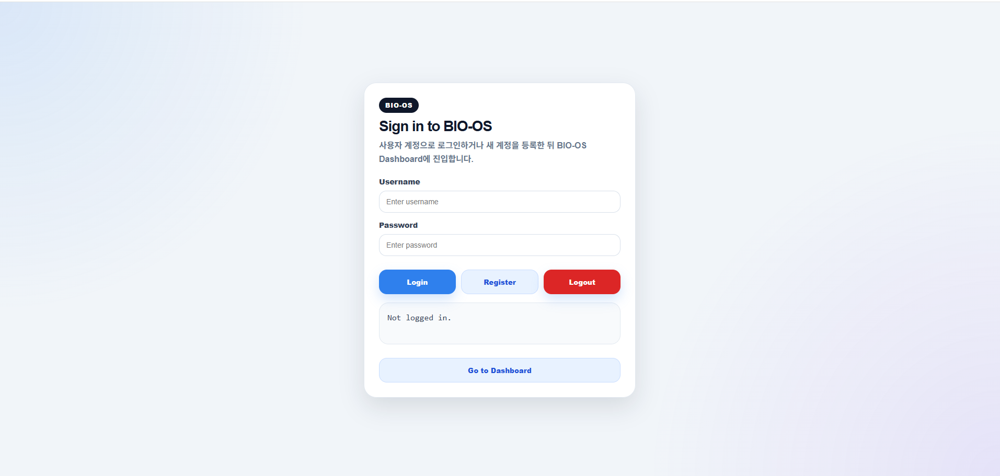
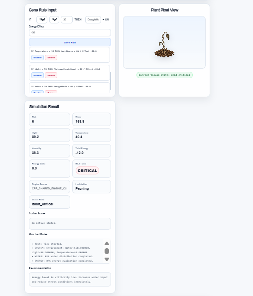
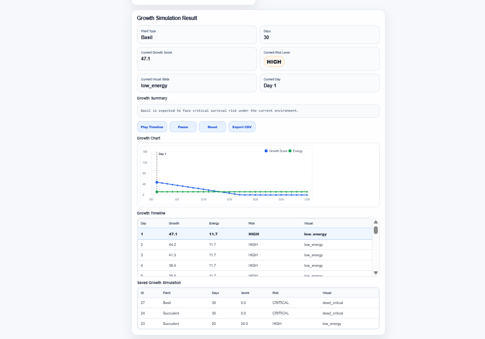
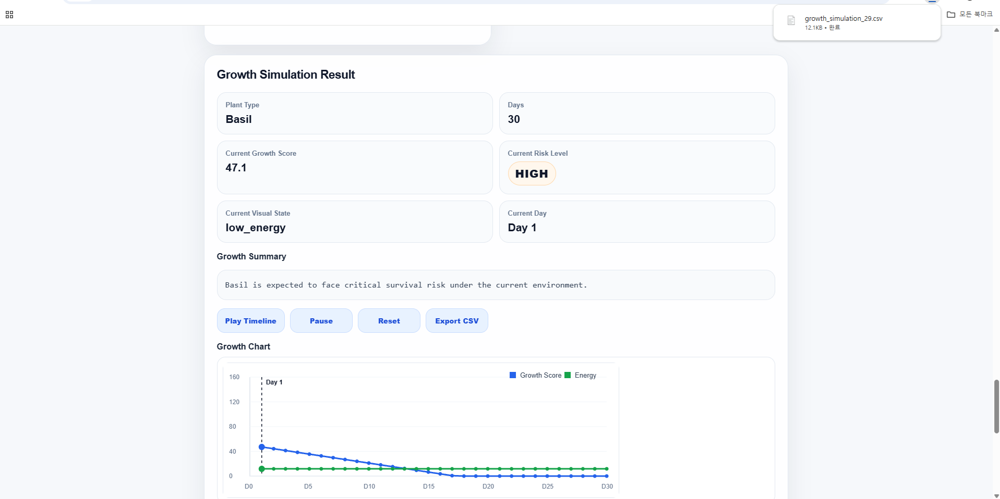
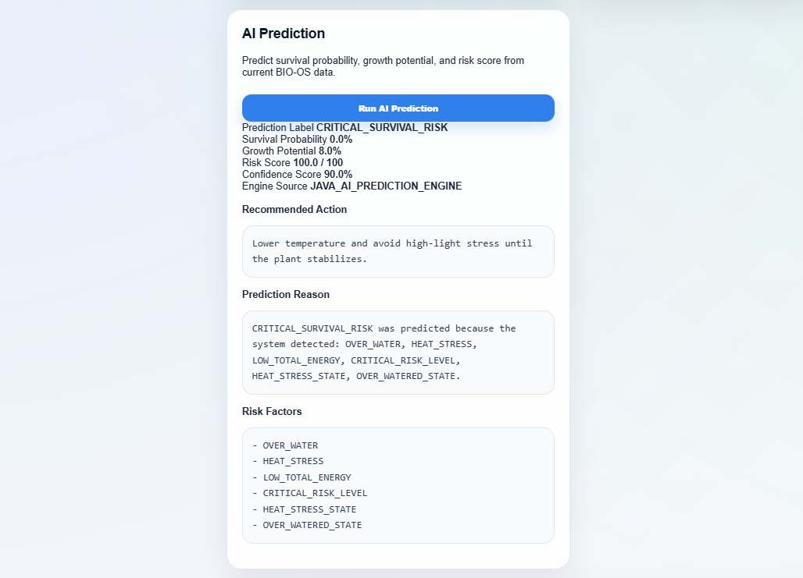
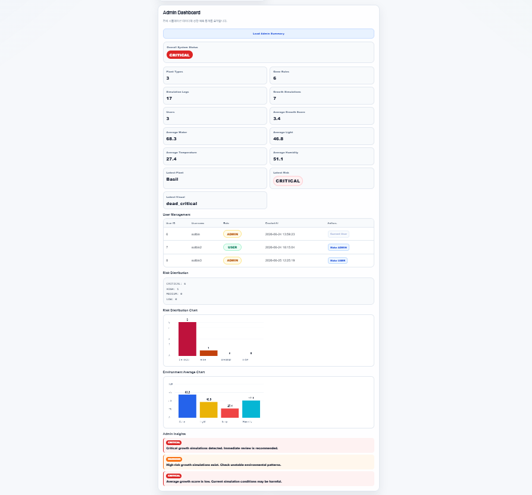

# BIO-OS

BIO-OS는 식물 생장 환경을 기반으로 가상 생체 시스템을 시뮬레이션하는 프로젝트입니다.

사용자는 물, 빛, 온도, 습도 값을 입력해 현재 식물 상태를 분석할 수 있고, Growth Simulation을 통해 며칠 뒤의 성장 상태를 예측할 수 있습니다. 또한 C++ 기반 시뮬레이션 엔진을 Spring Boot Backend와 연결하고, Web Dashboard에서 Simulation, Growth Timeline, CSV Export, AI Prediction, Admin Dashboard를 확인할 수 있도록 구성했습니다.

이 프로젝트의 핵심 목표는 단순한 CRUD 웹 애플리케이션이 아니라, 저수준 C++ 엔진과 Spring Boot Backend, Web Dashboard를 연결한 시뮬레이션 기반 시스템을 직접 설계하고 구현하는 것입니다.

---

## 프로젝트 개요

BIO-OS는 식물의 환경 데이터를 입력받아 다음과 같은 흐름으로 동작합니다.

```text
User Input
  ↓
Web Dashboard
  ↓
Spring Boot API
  ↓
C++ Simulation Engine / Java Prediction Layer
  ↓
Simulation Result / Growth Timeline / AI Prediction
  ↓
Web Dashboard Visualization
```

주요 기능은 다음과 같습니다.

* C++ 기반 BIO-OS Engine 실행
* Spring Boot에서 C++ CLI Engine 호출
* 환경값 기반 Simulation 실행
* 식물별 Growth Simulation 실행
* Growth Timeline 및 Chart 시각화
* 사용자별 Simulation Log 저장
* 사용자별 Growth Simulation 저장
* JWT 기반 로그인
* BCrypt 기반 비밀번호 암호화
* USER / ADMIN 권한 분리
* Admin Dashboard
* Admin User Management
* Admin Role Update
* CSV Export / Download
* AI Prediction Dashboard

---

## 기술 스택

### Backend

```text
Java 17
Spring Boot
Spring Web
Spring Data JPA
Spring Security
JWT
BCrypt
MySQL
Maven Wrapper
```

### Engine

```text
C++
CLI Engine
g++
MSYS2 / UCRT64
```

### Frontend

```text
HTML
CSS
JavaScript
Canvas Chart
LocalStorage
Fetch API
```

### Database

```text
MySQL
JPA Entity Mapping
```

### Version Control

```text
Git
GitHub
```

---

## 시스템 아키텍처

```text
BIO-OS
├─ Web Dashboard
│  ├─ auth.html
│  ├─ index.html
│  ├─ app.js
│  ├─ auth.js
│  └─ style.css
│
├─ Spring Boot Backend
│  ├─ Auth API
│  ├─ Simulation API
│  ├─ Growth Simulation API
│  ├─ AI Prediction API
│  ├─ Admin Dashboard API
│  ├─ Admin User Management API
│  ├─ JWT Authentication Filter
│  └─ C++ Engine Bridge Service
│
├─ C++ Engine
│  ├─ EngineFacade
│  ├─ Virtual Plant State
│  ├─ Water / Light / Temperature Evaluation
│  ├─ Energy Calculation
│  └─ CLI JSON Output
│
└─ MySQL
   ├─ user_accounts
   ├─ simulation_log
   ├─ growth_simulations
   ├─ growth_timeline
   ├─ plant_type
   └─ gene_rule
```

---

## 주요 기능

## 1. Auth

BIO-OS는 로그인 기반으로 동작합니다.

회원가입과 로그인을 통해 사용자 계정을 생성하고, 로그인 성공 시 JWT Token을 발급합니다. 이후 Web Dashboard의 API 요청은 Authorization Header에 JWT Token을 포함해 Backend로 전달됩니다.

```text
POST /api/auth/register
POST /api/auth/login
```

첫 번째로 가입한 사용자는 `ADMIN` 권한을 가지며, 이후 가입자는 기본적으로 `USER` 권한을 가집니다.

비밀번호는 BCrypt로 암호화되어 저장됩니다.

---

## 2. JWT 기반 인증

로그인 성공 후 Frontend는 사용자 정보와 JWT Token을 `localStorage`에 저장합니다.

```text
bioOsCurrentUser
bioOsJwtToken
```

이후 API 요청에는 다음과 같은 Header가 붙습니다.

```text
Authorization: Bearer {JWT_TOKEN}
```

Backend는 JWT Token을 검증하고, 현재 로그인한 사용자의 `userId`, `username`, `role` 정보를 Security Context에 저장합니다.

이 구조를 통해 Frontend에서 임의로 `userId`를 보내는 방식이 아니라, Backend가 JWT에서 현재 사용자를 판단하도록 구성했습니다.

---

## 3. Simulation

사용자는 물, 빛, 온도, 습도 값을 입력해 현재 식물 상태를 분석할 수 있습니다.

```text
POST /api/simulations/run
GET /api/simulations/logs
DELETE /api/simulations/logs
```

Simulation 결과에는 다음 정보가 포함됩니다.

```text
tick
water
light
temperature
humidity
totalEnergy
lastAction
visualState
activeStates
matchedRules
riskLevel
recommendation
engineSource
```

Simulation은 로그인한 사용자 기준으로 저장되며, USER 계정은 자신의 Simulation Log만 조회할 수 있습니다.

---

## 4. C++ Engine Bridge

BIO-OS는 C++ 기반 Engine을 CLI로 실행하고, Spring Boot Backend에서 해당 Engine을 호출합니다.

Spring Boot는 C++ Engine 실행 결과를 읽고, 마지막 JSON Snapshot을 파싱하여 Web Dashboard에 전달합니다.

```text
Web Dashboard
  ↓
Spring Boot Simulation API
  ↓
CppEngineBridgeService
  ↓
bio_os_engine.exe
  ↓
JSON Snapshot
  ↓
SimulationResponse
```

C++ Engine 테스트 예시는 다음과 같습니다.

```bash
./bio_os_engine.exe 15 80 32 60
```

Spring Boot에서 C++ Engine이 정상적으로 연결되면 Simulation 결과의 `engineSource` 값이 다음과 같이 표시됩니다.

```text
CPP_SHARED_ENGINE_CLI
```

C++ Engine 호출에 실패할 경우 Java Fallback Simulation으로 전환할 수 있도록 구성했습니다.

---

## 5. Growth Simulation

Growth Simulation은 현재 환경값을 기반으로 며칠 뒤 식물의 성장 상태를 예측합니다.

```text
POST /api/growth/simulate
GET /api/growth/simulations
GET /api/growth/simulations/{simulationId}
```

Growth Simulation 결과에는 다음 정보가 포함됩니다.

```text
plantType
days
initialWater
initialLight
initialTemperature
initialHumidity
finalGrowthScore
finalRiskLevel
finalVisualState
summary
timeline
```

Timeline은 날짜별로 다음 정보를 저장합니다.

```text
day
water
light
temperature
humidity
growthScore
totalEnergy
visualState
riskLevel
activeStates
matchedRules
```

Web Dashboard에서는 Timeline Table과 Canvas Chart를 통해 성장 점수와 에너지 변화를 시각화합니다.

---

## 6. Growth Timeline Playback

Growth Simulation 결과는 Timeline 형태로 재생할 수 있습니다.

```text
Play Timeline
Pause
Reset
```

각 날짜를 클릭하면 해당 날짜의 식물 상태 이미지, Growth Score, Risk Level, Visual State가 갱신됩니다.

---

## 7. CSV Export

저장된 Growth Simulation은 CSV 파일로 Export할 수 있습니다.

```text
GET /api/growth/simulations/{simulationId}/csv
```

CSV에는 Growth Timeline의 전체 데이터가 포함됩니다.

```csv
simulationId,plantType,day,water,light,temperature,humidity,growthScore,totalEnergy,visualState,riskLevel,activeStates,matchedRules
```

Web Dashboard에서는 `Export CSV` 버튼을 통해 다음과 같은 파일을 다운로드할 수 있습니다.

```text
growth_simulation_{simulationId}.csv
```

이 기능은 로그인한 사용자의 Growth Simulation에 대해서만 동작합니다.

---

## 8. AI Prediction

BIO-OS는 Simulation 또는 Growth Simulation 결과를 기반으로 AI Prediction 결과를 제공합니다.

```text
POST /api/ai/predict
```

AI Prediction 결과는 다음 정보를 반환합니다.

```text
predictionLabel
survivalProbability
growthPotential
riskScore
confidenceScore
recommendedAction
reason
riskFactors
engineSource
```

현재 AI Prediction은 Java 기반 Prediction Layer로 구현되어 있으며, 환경값, 위험 상태, 성장 점수, 에너지 점수, activeStates를 기반으로 예측 결과를 계산합니다.

예시 응답은 다음과 같습니다.

```json
{
  "predictionLabel": "HIGH_RISK_GROWTH",
  "survivalProbability": 42.5,
  "growthPotential": 31.0,
  "riskScore": 76.0,
  "confidenceScore": 100.0,
  "recommendedAction": "Increase water input gradually and monitor total energy recovery.",
  "reason": "HIGH_RISK_GROWTH was predicted because the system detected: LOW_WATER, HEAT_STRESS.",
  "riskFactors": [
    "LOW_WATER",
    "HEAT_STRESS"
  ],
  "engineSource": "JAVA_AI_PREDICTION_ENGINE"
}
```

Web Dashboard에서는 `Run AI Prediction` 버튼을 통해 Prediction 결과를 확인할 수 있습니다.

---

## 9. Admin Dashboard

ADMIN 계정은 전체 시스템 상태를 확인할 수 있습니다.

```text
GET /api/admin/summary
```

Admin Dashboard에서는 다음 정보를 제공합니다.

```text
Plant Type Count
Gene Rule Count
Simulation Log Count
Growth Simulation Count
User Count
Average Growth Score
Average Water
Average Light
Average Temperature
Average Humidity
Latest Plant
Latest Risk
Latest Visual State
Risk Distribution
Environment Average Chart
Admin Insights
Overall System Status
```

Overall System Status는 시스템 상태를 다음 값 중 하나로 요약합니다.

```text
CRITICAL
WARNING
STABLE
INFO
```

---

## 10. Admin User Management

ADMIN 계정은 전체 사용자 목록을 조회할 수 있습니다.

```text
GET /api/admin/users
```

응답에는 비밀번호 해시를 포함하지 않고, 필요한 사용자 정보만 반환합니다.

```json
{
  "userId": 1,
  "username": "admin",
  "role": "ADMIN",
  "createdAt": "2026-06-25T20:00:00"
}
```

ADMIN은 사용자 권한을 변경할 수 있습니다.

```text
PATCH /api/admin/users/{userId}/role
```

요청 예시는 다음과 같습니다.

```json
{
  "role": "ADMIN"
}
```

또는

```json
{
  "role": "USER"
}
```

단, ADMIN은 자기 자신의 권한을 직접 변경할 수 없습니다.

---

## 11. Role-based Access Control

BIO-OS는 USER와 ADMIN 권한을 분리합니다.

### USER

```text
Simulation 실행 가능
Simulation Log 조회 가능
Growth Simulation 실행 가능
Saved Growth Simulation 조회 가능
CSV Export 가능
AI Prediction 가능
Admin Dashboard 접근 불가
Gene Rule 관리 불가
User Management 접근 불가
```

### ADMIN

```text
Simulation 실행 가능
Growth Simulation 실행 가능
CSV Export 가능
AI Prediction 가능
Admin Dashboard 접근 가능
Gene Rule 관리 가능
User Management 가능
User Role Update 가능
```

Backend에서는 Spring Security 설정과 Controller 내부 검증을 함께 사용합니다.

```text
1차 방어: Spring Security URL 권한 검증
2차 방어: Controller requireAdmin()
```

---

## API 요약

## Auth API

```text
POST /api/auth/register
POST /api/auth/login
```

## Simulation API

```text
POST /api/simulations/run
GET /api/simulations/logs
DELETE /api/simulations/logs
```

## Growth Simulation API

```text
POST /api/growth/simulate
GET /api/growth/simulations
GET /api/growth/simulations/{simulationId}
GET /api/growth/simulations/{simulationId}/csv
```

## AI Prediction API

```text
POST /api/ai/predict
```

## Admin API

```text
GET /api/admin/summary
GET /api/admin/users
PATCH /api/admin/users/{userId}/role
```

## Gene Rule API

```text
POST /api/rules
GET /api/rules
PATCH /api/rules/{id}/toggle
DELETE /api/rules/{id}
```

## Plant Type API

```text
GET /api/plants
```

## C++ Engine API

```text
GET /api/engine/cpp/run
```

---

## 프로젝트 구조

```text
Bio_OS
├─ backend
│  └─ bio-os
│     ├─ src
│     │  └─ main
│     │     ├─ java
│     │     │  └─ com
│     │     │     └─ yusolbin
│     │     │        └─ bio_os
│     │     │           ├─ config
│     │     │           ├─ controller
│     │     │           ├─ dto
│     │     │           ├─ model
│     │     │           ├─ repository
│     │     │           ├─ security
│     │     │           └─ service
│     │     └─ resources
│     ├─ pom.xml
│     ├─ mvnw
│     └─ mvnw.cmd
│
├─ engine
│  ├─ bio_os_engine.cpp
│  ├─ build_engine.sh
│  ├─ bio_os_engine.exe
│  └─ bio_os_engine
│
└─ web
   ├─ auth.html
   ├─ auth.js
   ├─ index.html
   ├─ app.js
   ├─ style.css
   └─ assets
```

---

## 실행 방법

## 1. 사전 준비

다음 환경이 필요합니다.

```text
Java 17
MySQL
Git
MSYS2 UCRT64 또는 g++ 빌드 환경
Web Browser
```

Windows 환경에서는 Backend 실행은 PowerShell 또는 CMD에서 진행하고, C++ Engine 빌드는 MSYS2 UCRT64 환경에서 진행하는 것을 권장합니다.

---

## 2. 데이터베이스 생성

MySQL에서 데이터베이스를 생성합니다.

```sql
CREATE DATABASE bio_os
DEFAULT CHARACTER SET utf8mb4
COLLATE utf8mb4_unicode_ci;
```

Backend의 `application.properties`에서 MySQL 계정 정보를 자신의 환경에 맞게 설정합니다.

예시:

```properties
spring.datasource.url=jdbc:mysql://localhost:3306/bio_os?serverTimezone=Asia/Seoul&characterEncoding=UTF-8
spring.datasource.username=root
spring.datasource.password=your_password

spring.jpa.hibernate.ddl-auto=update
spring.jpa.show-sql=true
spring.jpa.properties.hibernate.format_sql=true
```

---

## 3. C++ Engine 빌드

MSYS2 UCRT64 또는 g++ 사용 가능한 환경에서 Engine을 빌드합니다.

```bash
cd /d/CoreSync/Bio_OS/engine
bash build_engine.sh
```

빌드 후 실행 테스트를 진행합니다.

```bash
./bio_os_engine.exe 15 80 32 60
```

정상적으로 실행되면 Engine Log와 JSON Snapshot이 출력됩니다.

---

## 4. Spring Boot Backend 실행

PowerShell 또는 CMD에서 Backend 폴더로 이동합니다.

```powershell
cd D:\CoreSync\Bio_OS\backend\bio-os
.\mvnw.cmd spring-boot:run
```

Backend는 기본적으로 다음 주소에서 실행됩니다.

```text
http://localhost:8080
```

---

## 5. Web Dashboard 실행

`web/auth.html`을 브라우저에서 열어 로그인 화면에 접속합니다.

권장 방법은 VS Code Live Server를 사용하는 것입니다.

```text
web/auth.html
```

또는 브라우저에서 직접 열 수 있습니다.

```text
file:///D:/CoreSync/Bio_OS/web/auth.html
```

로그인 성공 후 `index.html`로 이동합니다.

---

## 6. 첫 번째 계정 생성

처음 회원가입한 계정은 ADMIN이 됩니다.

```text
1번째 가입 계정: ADMIN
2번째 이후 가입 계정: USER
```

따라서 테스트를 위해 먼저 ADMIN 계정을 생성한 뒤, 별도의 USER 계정을 추가로 생성하는 것을 권장합니다.

---

## 테스트 시나리오

## USER 계정 테스트

```text
1. USER 계정으로 로그인
2. Run Simulation 실행
3. Load Logs로 사용자별 로그 확인
4. Growth Simulation 실행
5. Saved Growth Simulation 조회
6. Growth Timeline 클릭 및 Play
7. Export CSV 다운로드
8. Run AI Prediction 실행
9. Admin Dashboard 접근 불가 확인
10. Gene Rule 관리 불가 확인
```

## ADMIN 계정 테스트

```text
1. ADMIN 계정으로 로그인
2. Run Simulation 실행
3. Growth Simulation 실행
4. Admin Dashboard 조회
5. User Management 조회
6. User Role Update 실행
7. Gene Rule 생성 / 수정 / 삭제
8. Risk Distribution Chart 확인
9. Environment Average Chart 확인
10. AI Prediction 실행
```

---

## 보안 구조

BIO-OS는 다음 보안 구조를 사용합니다.

```text
BCrypt Password Encoding
JWT Token Authentication
Spring Security Filter Chain
Role-based Access Control
User-scoped Data Access
Admin-only API Guard
```

사용자별 데이터는 JWT에서 추출한 현재 사용자 ID를 기준으로 처리합니다.

Frontend에서 전달하는 `userId` 값을 신뢰하지 않고, Backend에서 Security Context를 통해 현재 사용자를 확인합니다.

Growth Simulation 상세 조회도 소유자 검증을 거치며, 다른 사용자의 Simulation ID를 직접 호출해도 조회되지 않습니다.

---

## 주요 구현 포인트

## C++ Engine과 Spring Boot 연결

C++ Engine을 별도 CLI 프로그램으로 실행하고, Spring Boot에서 ProcessBuilder를 통해 호출합니다.

Backend는 C++ Engine의 stdout을 읽고, 마지막 JSON Snapshot을 파싱해 SimulationResponse로 변환합니다.

이 구조를 통해 Web Dashboard는 C++ Engine 내부 구현을 직접 알 필요 없이 Spring API를 통해 결과만 받을 수 있습니다.

---

## 사용자별 데이터 분리

Simulation Log와 Growth Simulation은 UserAccount와 연결됩니다.

로그인한 사용자는 자신의 기록만 조회할 수 있으며, ADMIN은 Admin Dashboard를 통해 전체 통계 정보를 확인할 수 있습니다.

---

## Admin Dashboard

Admin Dashboard는 시스템 전체 상태를 요약합니다.

Risk Distribution, Environment Average, Overall System Status, Admin Insights를 통해 시스템 상태를 관리자 관점에서 확인할 수 있습니다.

---

## AI Prediction Layer

AI Prediction은 Simulation 및 Growth Simulation 결과를 바탕으로 생존 확률, 성장 가능성, 위험 점수, 추천 조치를 계산합니다.

현재는 Java 기반 Prediction Layer로 구현되어 있으며, 이후 Python 기반 ML Model 또는 외부 AI Engine과 연동할 수 있는 구조로 확장할 수 있습니다.

---

## CSV Export

Growth Simulation Timeline을 CSV로 Export할 수 있습니다.

이는 실험 결과를 외부에서 분석하거나, 포트폴리오에서 데이터 기반 기능을 보여주기 위한 기능입니다.

---

## 스크린샷

아래 이미지는 BIO-OS의 주요 기능 흐름을 보여주는 화면입니다.

> 이미지 파일은 프로젝트 루트 기준 `docs/images/` 폴더에 넣어두면 됩니다.

```text
docs/images/01-auth.png
docs/images/02-simulation-dashboard.png
docs/images/03-growth-simulation.png
docs/images/04-csv-export.png
docs/images/05-ai-prediction.png
docs/images/06-admin-dashboard.png
docs/images/07-admin-user-management.png
```

### 1. Auth

로그인과 회원가입을 담당하는 화면입니다.  
로그인 성공 시 JWT Token이 발급되고, 이후 Web Dashboard 요청에 Authorization Header가 포함됩니다.



---

### 2. Simulation Dashboard

물, 빛, 온도, 습도 값을 입력해 현재 식물 상태를 분석하는 화면입니다.  
C++ Engine Bridge가 정상적으로 연결되면 `Engine Source`에 `CPP_SHARED_ENGINE_CLI`가 표시됩니다.



---

### 3. Growth Simulation

현재 환경값을 기반으로 며칠 뒤 식물의 성장 상태를 예측하는 화면입니다.  
Growth Timeline Table과 Canvas Chart를 통해 날짜별 Growth Score, Energy, Risk Level 변화를 확인할 수 있습니다.



---

### 4. CSV Export

저장된 Growth Simulation의 Timeline 데이터를 CSV 파일로 다운로드하는 기능입니다.  
Export CSV 버튼을 통해 `growth_simulation_{simulationId}.csv` 형식의 파일을 받을 수 있습니다.



---

### 5. AI Prediction

Simulation 또는 Growth Simulation 결과를 기반으로 생존 확률, 성장 가능성, 위험 점수, 추천 조치를 예측하는 화면입니다.



---

### 6. Admin Dashboard

ADMIN 계정으로 전체 시스템 상태를 확인하는 화면입니다.  
Simulation Log 수, Growth Simulation 수, User 수, 평균 환경값, Risk Distribution, Overall System Status, Admin Insights를 확인할 수 있습니다.


---

### 7. Admin User Management

ADMIN 계정으로 전체 사용자 목록을 확인하고, 사용자 권한을 변경할 수 있는 화면입니다.  
자기 자신의 권한 변경은 막혀 있으며, USER / ADMIN Role Update가 가능합니다.



---

## 현재 한계

현재 버전은 포트폴리오와 학습 목적에 맞춘 완성 버전입니다.

개선 가능한 부분은 다음과 같습니다.

```text
Production 수준의 Refresh Token 구조는 아직 없음
AI Prediction은 실제 학습 모델이 아니라 Java 기반 Prediction Layer임
Backend 테스트 코드가 충분하지 않음
Docker 배포 구성이 아직 없음
CI/CD 파이프라인이 아직 없음
C++ Engine의 환경값 반영 범위를 더 확장할 수 있음
```

---

## 향후 개선 방향

```text
Python ML Model 연동
실제 학습 데이터 기반 Prediction Model 적용
Docker Compose 구성
JUnit / Integration Test 추가
GitHub Actions 기반 CI 구성
Refresh Token 기반 로그인 유지
Admin Audit Log 추가
User Activity Log 추가
C++ Engine 기능 확장
배포 환경 구성
```

---

## 버전

```text
BIO-OS v1.0 Portfolio Release
```

포함 기능:

```text
C++ Engine Bridge
Simulation Dashboard
Growth Simulation
Growth Timeline Chart
CSV Export
JWT Authentication
User-scoped Data
Admin Dashboard
Admin User Management
Role Update
AI Prediction Dashboard
```

---

## 작성자

```text
임민주
IT / AI / System Software / Low-level Programming
```

---

## License

이 프로젝트는 학습 및 포트폴리오 목적으로 제작되었습니다.
